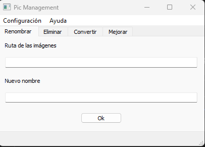

# Pic_Management

### **UI to manage pictures**

  

## You can manage all images contained on a folder
- "Rename" tab allows to change the name of all files
- "Delete" tab allows to delete some characters on the name  
- "Convert" tab allows to past all images on the folder from webp, jpg, jpeg and png to webp or png
- "Enhance" tab enhances the images on the folder **(this function is still on development)**
- Rename and Delete works with all kind of files
- **configuration and help is still on development**